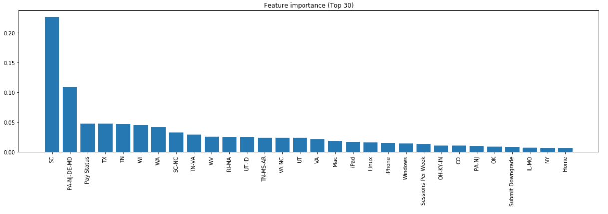

# Motivation

In this project I will use user log data of the fictional 
music streaming provider Sparkify in order to predict customer 
churn. 

Customer churn refers to the direct or indirect 
cancellation of a service by the customer. For the service 
provider it often goes hand in hand with a permanent loss of 
the customer relationship. 

Companies therefore have great 
interest in technologies that help them to identify customers 
with a high churn risk in advance. 

# Files

* `Sparkify.ipynb`: The notebook that contains all the relevant code 
and explanations
* `mini_sparkify_event_data.json`: The user log data that is used for 
churn prediction

# Notebook Structure

In the notebook I will demonstrate the full process of churn prediction 
on the given user log data:

* Data Loading
* Data Exploration
* Data Cleaning
* Feature Engineering
* Model Training
* Model Selection
* Evaluation

# Libraries

I am using the following five packages in this analysis:
* `pyspark` (3.0.0)
* `pandas` (1.0.3)
* `numpy` (1.18.4)
* `matplotlib` (3.1.3)
* `seaborn` (0.10.0)

# Results
The best model from cross validation is the Random Forest with 
the parameters numTrees = 50 and maxDepth = 8, and an average 
F1 score of 0.82.

# Next Steps
* Run the script on AWS cluster and apply analysis to the full data set
* Add more parameters and corresponding values to the hyper parameter space 
* Put more effort into the feature selection process, e.g. to eliminate 
superfluous features 

# Acknowledgement
Thanks to Udacity for this strong learning curve during this Nanodegree.

# Blog Post
You find additional information to the project in the [blog post](https://medium.com/@marcus.winter.privat/project-overview-7560482a627).